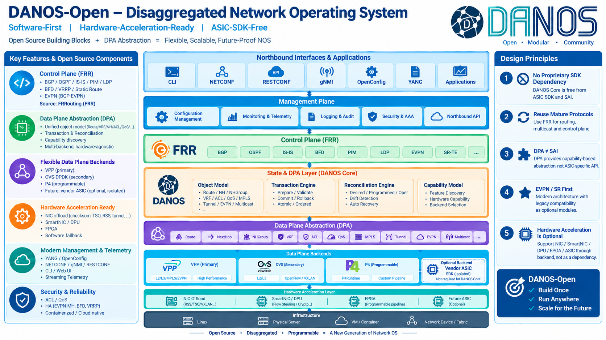

# DANOS ISO Build

This repository provides the live-build recipe for a DANOS 2608 / Debian 13 amd64 ISO. 
The official flow is to build Debian packages from source, publish an APT repository, and generate an ISO with live-build. 
The current pipeline uses OBS for package builds and can publish immutable repository snapshots through Cloudflare R2.

## DANOS Architecture



## Local Container Build

Docker is required. 
The container runs in privileged mode because live-build needs chroot, mount, loop, and squashfs operations:

```bash
./scripts/build-iso-container.sh
```

Default APT source:

```text
https://r2.aikon.qzz.io/danos-apt/test/
```

Override it when required:

```bash
DANOS_APT_URL=https://apt.example/2608/snapshot/ \
SOURCE_DATE_EPOCH=1758956640 \
./scripts/build-iso-container.sh
```

Artifacts are written to `container-output/`, including the ISO, SHA256 file, build log, and live-build metadata. 
The container copies only source and configuration files, excluding stale host-side `.build/`, `binary/`, `cache/`, and `chroot/` directories.

See the following documents for design details:

- [Container Build](docs/CONTAINER-BUILD.md)
- [OBS to R2 APT Repository](docs/R2-APT.md)
- [GitHub CI/CD Plan](docs/CI-CD-PLAN.md)
- [Comparison with jsouthworth](docs/COMPARISON.md)
